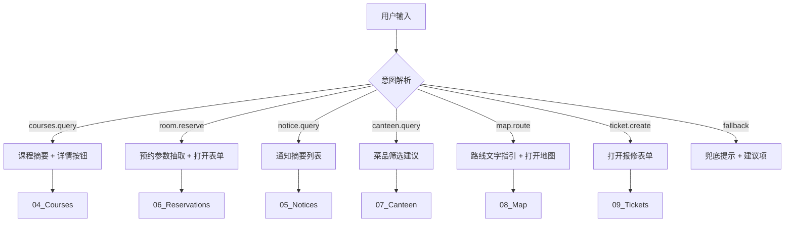

# 流程图

```mermaid
flowchart TD
A[用户输入] --> B{意图解析}
B -->|courses.query| C[课程摘要 + 详情按钮]
B -->|room.reserve| D[预约参数抽取 + 打开表单]
B -->|notice.query| E[通知摘要列表]
B -->|canteen.query| F[菜品筛选建议]
B -->|map.route| G[路线文字指引 + 打开地图]
B -->|ticket.create| H[打开报修表单]
B -->|fallback| I[兜底提示 + 建议项]
C --> J[04_Courses]
D --> K[06_Reservations]
E --> L[05_Notices]
F --> M[07_Canteen]
G --> N[08_Map]
H --> O[09_Tickets]
```
